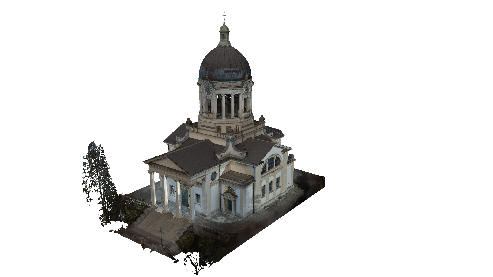
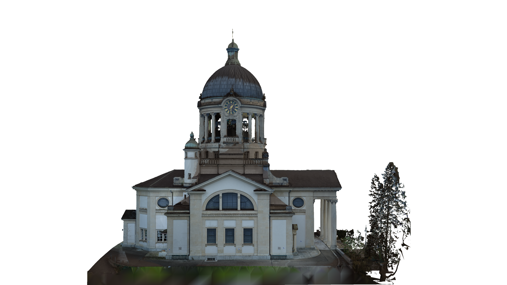
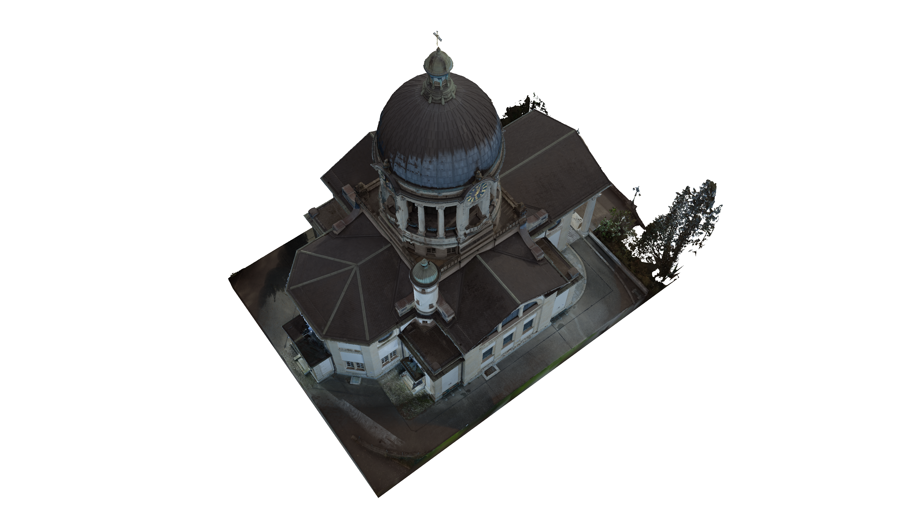
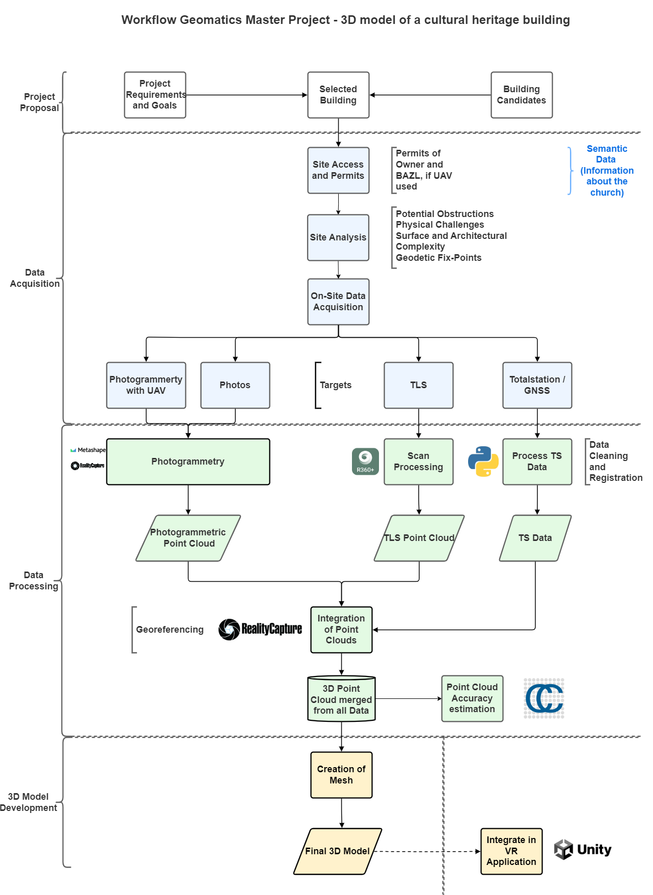
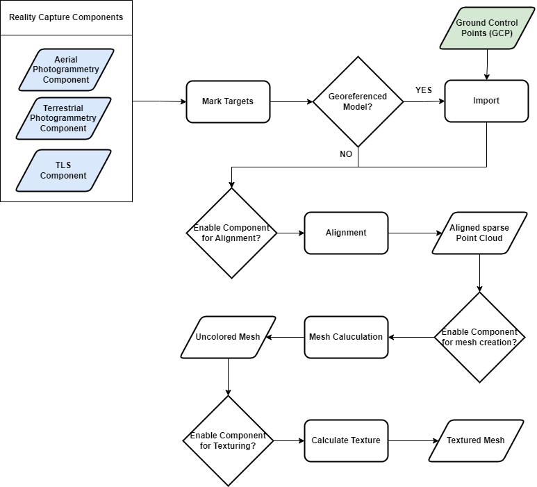
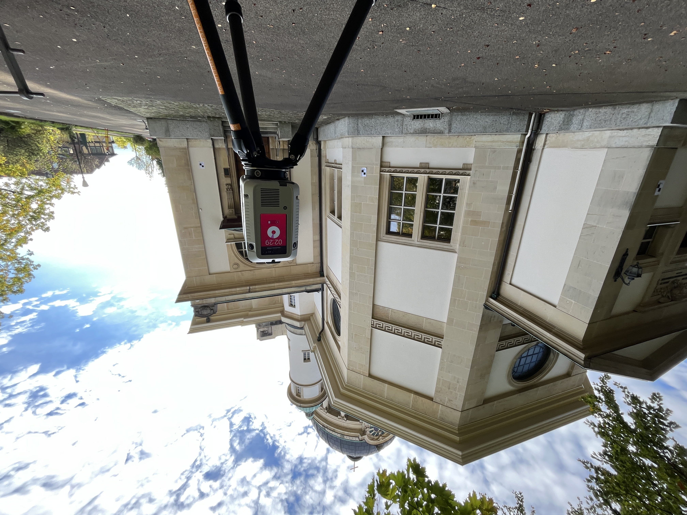
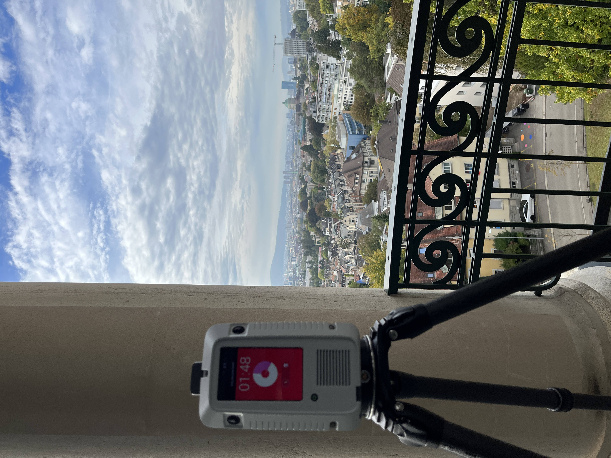
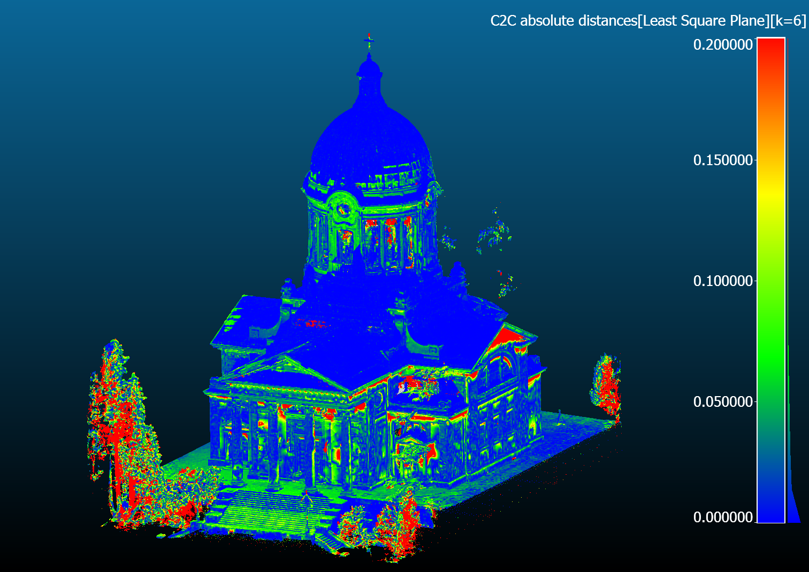
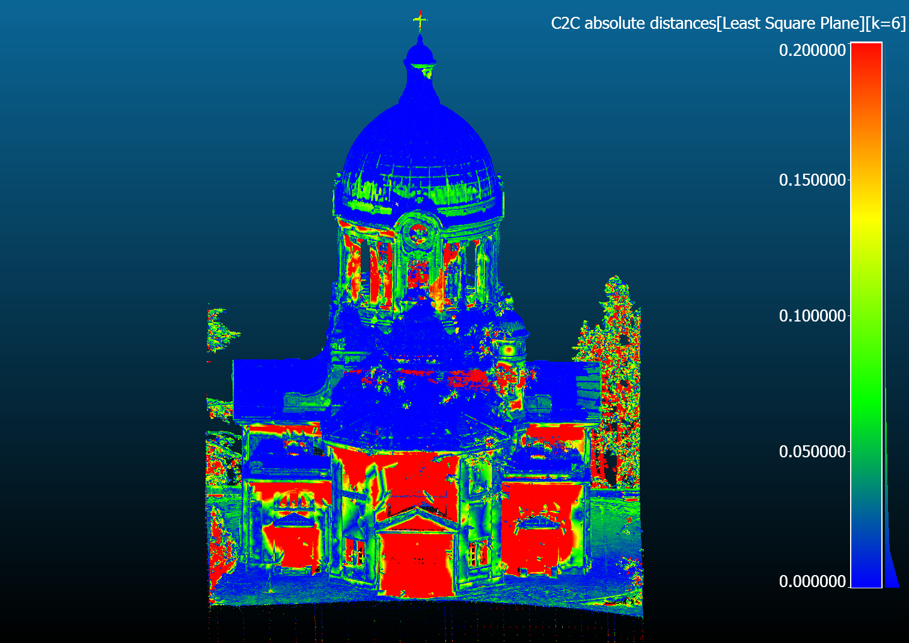
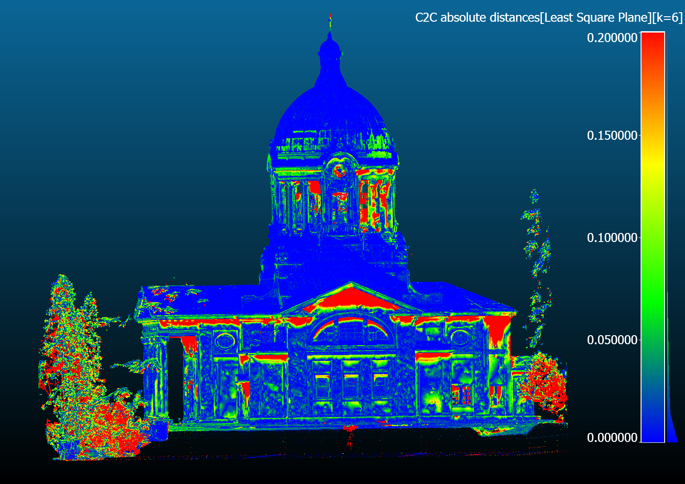

# Welcome to the ETH Zurich Geomatics Master Project:   "3D model of a cultural heritage building"  
This repository contains methods and results of a ETH Zurich Geomatics MSc project developed by Thierry Weber. The project had three main goals: Creating a **digital twin** of a cultural heritage building in Switzerland, including the 3D model in a **VR-Experience** and **assessing the accuracy** of the obtained 3D model. 

## Abstract

  In the span of a semester at ETH Zurich, a high-detail, digital 3D model of the exterior of Kreuzkirche in 
Hottingen ZH was reconstructed. Scoping the full workflow of modern cultural heritage documentation, the 
project started with data acquisition, covered data processing, modelling and finished with the visualization 
of the resulting 3D model. Fusing photogrammetry and laser scanning techniques to document Kreuzkirche’s challenging architecture has proven to be a suitable approach. Aerial and terrestrial data acquisitions
have supplemented each other to minimize data gaps. Whereas laser scanning has contributed to geometric precision, the high-quality photogrammetric images ensured a detailed texture on the model. During 
the data processing step, experiments were conducted to find a combination of data and settings which 
led to the best possible results. The point clouds resulting from different combinations of data enabled 
during the reconstruction were assessed for their accuracy by comparing them to the highest-quality point 
cloud. Additionally, the final point cloud was assessed using ground reference points from the Swiss national reference frame. It was found that there are some data gaps, leading to noisy parts in the reconstructed model. This although a comprehensive site analysis and acquisition planning were done beforehand.  
  
A key element of the project was the development of a VR-Experience, which allowed viewers to interactively tour Kreuzkirche. Feedback from a group of test users turned out positive, with a notable emphasis 
on the functionality allowing real-life size enlargement of the model. The interactive features that allowed 
users to acquire comprehensive information about the church were well-received, as they improved the 
educational part of the experience. Due to the limitations on processing power on the VR device, a tradeoff between model quality and the lagging of the application had to be weighted up

## The Model:

 The following renderings show the highest quality Mesh of Kreuzkirche created in this project. 

3D Models to download can be found in the *3D Models* folder. 

## VR-Experience

  The Virtual Reality (VR) experience created as part of this project, has three main functionalities (shown in the GIFS below). First the user can 
  show or hide the information buttons distributed over the scaled 3D model with the big button on the left side of the pedestal. The big button on 
  the right side of the pedestal, allows the user to enlarge the model to full scale and shrink it again. When clicked, the information buttons on the scaled 
  model show information about the church.

  
   
   

## Workflow 

  The diagram below provides an overview of the project's workflow. The project started with selecting an interesting cultural heritage building. 
  This was done by visiting mulitple churches in the city of Zurich (Fraumünster, Kirche Enge, Kreuzkirche). After assessing the situation at each church, 
  the decision fell on Kreuzkirche in Hottingen ZH. While planning the data acquisition, not only the required instruments had to be defined, but site access, permits and restrictions had to be checked out.
  With the architectural complexity and size of the church, drone data had to be included to realize this project. With drone flight restictions in Switzerland, clarification for legal drone flight at Kreuzkirche had to be made. TO BE CONTINUED

  A more detailed workflow for the integration of the point clouds of all components in Reality Capture is shown in the diagram below.

## Data Acquisition

  The acquisition of all data used took place in one day and was carried out in a two-person team. At this point, a huge thank you to my advisor Matej Varga for the great support during the acquisition day.
  Here are some impressions of the acquisition day. The weather was a mix of clouds and sun shine, which complicated the photogrammetry part during the recording of the data, but also in the processing. Fortunately, we were allowed to also collect data from the dome structure of the church. Side note, the view over Zurich City is stunning from up there!

  
   
  

## Point Cloud Accuracy Assessment 

The following figures show the cloud-to-cloud distance between the point cloud obtained using data and the one obtained only from drone photogrammetry. The differences are in meters. 
As expected, the areas with high discrepancies are the once with data gabs from the drone data. The back facade (alot of red in the plot) was close to high trees, which prevented 
detailed drone images of the facade.

## Conclusion and Outlook

Throughout one semester at ETH Zurich, a high-detail 3D model of the outside of Kreuzkirche in Hottingen 
Zurich was constructed. This model was then visualized in a VR-Experience. Additionally, an accuracy 
assessment of the dense point clouds was conducted. Overall, the three main goals have been met. Despite the challenging architecture of the building, the reconstructed 3D model turned out to be suitable for 
visualization purposes. The combination of photogrammetry and laser scanning to model a digital twin of 
a cultural heritage building was proven to be beneficial for the resulting model. Whereas the laser scan 
contributes most to the geometric accuracy, good-quality images enable a highly detailed texture. The 
developed VR-Experience lets the user explore Kreuzkirche in a fun and interactive way, which was confirmed by a hand full of test users. The functionality to enlarge the model to real-life size was the favorite
of all users. They also appreciated the way of interacting with the model to view detailed information about 
the church. The results from the accuracy assessment backed up the theory that the combination of photogrammetry and laser scans can be beneficial for creating a 3D model of a cultural heritage building.  
  
In addition to helping with the preservation and documentation of cultural heritage buildings, this project 
shows that the digital model could be used to showcase such a building in a museum. One way to do so 
would be in a VR-Experience as developed in this project.  
Having a well-structured workflow for a project like this is crucial. Especially as the project includes all 
steps involved in creating a 3D model of a building, from data acquisition to data processing and visualizing 
the result. Despite the structure of the project, there are a few points that could be improved for future 
work. Starting with the planning phase, it is important to think about how to combine different data in the 
alignment process. Especially with aerial and terrestrial data, having enough common control points is 
important. This also means creating control points above ground-level. With one data set from the TLS not 
having any control points on the ground level and only a few to match within the dome, this is not planned 
ideally in this project.  
Moving on to the data acquisition itself, a one-day measuring campaign with a two-person team was not 
enough for a building of this size and architectural complexity. Unfortunately this led to data that was missing in the end. Which even influenced the final model. For a future project, I would recommend reserving 
more time for the data acquisition. Like this, more data can be collected. Personally, I would have liked to 
increase the number of drone images and TLS standpoint. Furthermore, acquiring photogrammetric data 
in central Europe in autumn is not ideal. The sun stays low through the day, casting long shadows. Plus, 
the weather is rather unstable. Ideal conditions would be a cloud-covered sky all day to ensure soft lighting 
conditions.  
Concluding the data processing, there are many ways and software for combining photogrammetry and 
laser scan data. Reality Capture was found to be an impressive software which is able to merge photogrammetry and laser scans and process them into a 3D model. It includes all the tools needed for the steps 
described within this report, from aligning components to mesh creation, texturing and finally cleaning the 
model. A setting that could be played with in future work is the weight of different components during the 
mesh generation. As seen in the results, there are still some unwanted artefacts of the tree shadow visible 
in the mesh. Giving the photogrammetric data less weight in that part of the model could improve the result.  

Another interesting exploration to make in future work would be to test how well the alignment of different 
component would work without having placed physical targets on the object. With photogrammetry software having advanced a lot in the past few years, it could be possible to let the software decide on key 
features in the scene. This would bring the advantage that during the cleaning step, the physical targets 
would not need to be removed manually or remain visible in the final model.  

Including a model of the church's inside would significantly improve the outcome. This would be beneficial 
for both the VR-Experience and the documentation side.  
To finally conclude the VR-Experience, it can be said that this is a suitable way of visualizing a 3D model. 
Although I am overall quite satisfied with the application, there are a few points I would like to mention 
which could be focused on in future projects. As mentioned in the discussion, there is still some lag occurring in the application, if the user stands in a specific distance from the model. This is one thing that could 
be investigated more. I assume this is connected with finding a way to down-sample the model in complexity without losing too much detail. A second point to further investigate would be the integration of a 
DEM, which was not achieved within the scope of this project.

