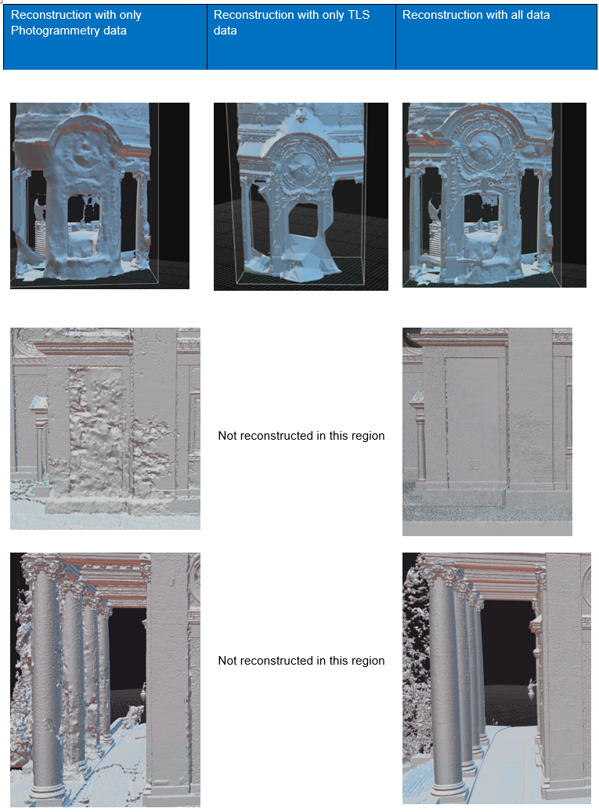

# Welcome to the ETH Zurich Geomatics Master Project:   "3D model of a cultural heritage building"  
This repository contains methods and results of a ETH Zurich Geomatics MSc project developed by Thierry Weber. The project had three main goals: Creating a **digital twin** of a cultural heritage building in Switzerland, including the 3D model in a **VR-Experience** and **assessing the accuracy** of the obtained 3D model. 

## Abstract

  In the span of a semester at ETH Zurich, a high-detail, digital 3D model of the exterior of Kreuzkirche in 
Hottingen ZH was reconstructed. Scoping the full workflow of modern cultural heritage documentation, the 
project started with data acquisition, covered data processing, modelling and finished with the visualization 
of the resulting 3D model. Fusing photogrammetry and laser scanning techniques to document Kreuzkirche’s challenging architecture has proven to be a suitable approach. Aerial and terrestrial data acquisitions
have supplemented each other to minimize data gaps. Whereas laser scanning has contributed to geometric precision, the high-quality photogrammetric images ensured a detailed texture on the model. During 
the data processing step, experiments were conducted to find a combination of data and settings which 
led to the best possible results. The point clouds resulting from different combinations of data enabled 
during the reconstruction were assessed for their accuracy by comparing them to the highest-quality point 
cloud. Additionally, the final point cloud was assessed using ground reference points from the Swiss national reference frame. It was found that there are some data gaps, leading to noisy parts in the reconstructed model. This although a comprehensive site analysis and acquisition planning were done beforehand.  
  
A key element of the project was the development of a VR-Experience, which allowed viewers to interactively tour Kreuzkirche. Feedback from a group of test users turned out positive, with a notable emphasis 
on the functionality allowing real-life size enlargement of the model. The interactive features that allowed 
users to acquire comprehensive information about the church were well-received, as they improved the 
educational part of the experience. Due to the limitations on processing power on the VR device, a tradeoff between model quality and the lagging of the application had to be weighted up

## The Model:

 The following renderings show the highest quality Mesh of Kreuzkirche created in this project. 

3D Models to download can be found in the *3D Models* folder. 

## VR-Experience

  The Virtual Reality (VR) experience created as part of this project, has three main functionalities (shown in the GIFS below). First the user can 
  show or hide the information buttons distributed over the scaled 3D model with the big button on the left side of the pedestal. The big button on 
  the right side of the pedestal, allows the user to enlarge the model to full scale and shrink it again. When clicked, the information buttons on the scaled 
  model show information about the church.

  
   
   

## Workflow 

  
Going through the general workflow presented in the diagram below, the project started with finding a suitable cultural 
heritage building to replicate. Three different churches in the city of Zurich were visited and rated according 
to four main factors: Cultural value, passer-by frequency, accessibility, contact to responsible person. The 
three candidates were Kreuzkirche, Fraumünster and Kirche Enge. Although Fraumünster would have the 
highest cultural value, the accessibility and passer-by frequency were the main factors not ideal, as it is 
situated in the city center- Finally, the decision fell on Kreuzkirche in Hottingen Zurich. 
Next was an extensive site analysis, which included getting all permits and looking up any restriction. With 
that done, the planning on what data would be needed and how to acquire it took place. Some of the 
instruments required more substantial planning for the acquisition day then others. 
After acquiring all data in one day, the processing steps began. The pre-processing started in separate 
software. The alignment and modelling was later mainly done in Reality Capture (Reality Capture, 2023). 
The accuracy Assessment was done in Python and Cloud Compare (Cloud Compare, 2023). As a final 
step the model was integrated into a VR-Experience. More details on each step can be read in the 
following subsection. 

  A more detailed workflow for the integration of the point clouds of all components in Reality Capture is shown in the diagram below.

## Data Acquisition

  The acquisition of all data used took place in one day and was carried out in a two-person team. At this point, a huge thank you to my advisor Matej Varga for the great support during the acquisition day.
  Here are some impressions of the acquisition day. The weather was a mix of clouds and sun shine, which complicated the photogrammetry part during the recording of the data, but also in the processing. Fortunately, we were allowed to also collect data from the dome structure of the church. Side note, the view over Zurich City is stunning from up there!

  
   
  

## Mesh Tests

As part of the project, some tests on settings and what data to use for the best mesh result were conducted.  One of them was the cutout of the dome structure on the back facade of the church (first 
row in the figure below). This region was especially interesting, as it was prone to lack of data. Tbe figure below shows
the results of reconstruction, enabling different components. Enabling only photogrammetry data led to 
noisy edges and therefore loss of detail. Looking at the reconstruction with TLS data, the small details are 
preserved and the mesh is much less noisy. Of course, it failed at places with data gaps, such as the lower 
part of the railing. Combining all components allowed us to compensate for the data gap in the TLS data 
while still keeping much of the detail.  
  
Another interesting reconstruction challenge for the photogrammetric data can be seen in the second row 
in Figure 20. The noise in the facade occurred due to heavy shadows casted by the tree next to the church. 
As the alignment of images relies on key features similar to each other from image to image, this highly 
spatially varying pattern prevented a clean reconstruction. In this situation, the laser scan can make up for 
it, as seen in the screenshot on the right side. The influence of the photogrammetry components is still 
visible.   

Focusing on the last row, the reconstruction challenges of the pillar in front of the main entrance are visible. 
Here again, the photogrammetry data leads to noisy reconstruction and TLS data is able to improve the 
result.

## Point Cloud Accuracy Assessment 

The following figures show the cloud-to-cloud distance between the point cloud obtained using data and the one obtained only from drone photogrammetry. The differences are in meters. 
The scale on the right side of each screenshot has the unit meter and shows 
the absolute distance between both point clouds. Blue indicates null to minor differences of 5 cm. The 
scale reaches up to 20cm in difference, which is indicated in red in the plots. As expected, the areas with high discrepancies are the once with data gabs from the drone data. The back facade (alot of red in the plot) was close to high trees, which prevented 
detailed drone images of the facade.  
  
Noteworthy are the big red patches on the smaller dome next to the main dome, as this was well visible 
from the drone perspective but still led to a noisy reconstruction. Also, parts of the facade include deviations 
of up to 15 cm, although they were visible from the drone

## Conclusion and Outlook

Throughout one semester at ETH Zurich, a high-detail 3D model of the outside of Kreuzkirche in Hottingen 
Zurich was constructed. This model was then visualized in a VR-Experience. Additionally, an accuracy 
assessment of the dense point clouds was conducted. Overall, the three main goals have been met. Despite the challenging architecture of the building, the reconstructed 3D model turned out to be suitable for 
visualization purposes. The combination of photogrammetry and laser scanning to model a digital twin of 
a cultural heritage building was proven to be beneficial for the resulting model. Whereas the laser scan 
contributes most to the geometric accuracy, good-quality images enable a highly detailed texture. The 
developed VR-Experience lets the user explore Kreuzkirche in a fun and interactive way, which was confirmed by a hand full of test users. The functionality to enlarge the model to real-life size was the favorite
of all users. They also appreciated the way of interacting with the model to view detailed information about 
the church. The results from the accuracy assessment backed up the theory that the combination of photogrammetry and laser scans can be beneficial for creating a 3D model of a cultural heritage building.  
  
In addition to helping with the preservation and documentation of cultural heritage buildings, this project 
shows that the digital model could be used to showcase such a building in a museum. One way to do so 
would be in a VR-Experience as developed in this project.  
Having a well-structured workflow for a project like this is crucial. Especially as the project includes all 
steps involved in creating a 3D model of a building, from data acquisition to data processing and visualizing 
the result. Despite the structure of the project, there are a few points that could be improved for future 
work. Starting with the planning phase, it is important to think about how to combine different data in the 
alignment process. Especially with aerial and terrestrial data, having enough common control points is 
important. This also means creating control points above ground-level. With one data set from the TLS not 
having any control points on the ground level and only a few to match within the dome, this is not planned 
ideally in this project.  
Moving on to the data acquisition itself, a one-day measuring campaign with a two-person team was not 
enough for a building of this size and architectural complexity. Unfortunately this led to data that was missing in the end. Which even influenced the final model. For a future project, I would recommend reserving 
more time for the data acquisition. Like this, more data can be collected. Personally, I would have liked to 
increase the number of drone images and TLS standpoint. Furthermore, acquiring photogrammetric data 
in central Europe in autumn is not ideal. The sun stays low through the day, casting long shadows. Plus, 
the weather is rather unstable. Ideal conditions would be a cloud-covered sky all day to ensure soft lighting 
conditions.  
Concluding the data processing, there are many ways and software for combining photogrammetry and 
laser scan data. Reality Capture was found to be an impressive software which is able to merge photogrammetry and laser scans and process them into a 3D model. It includes all the tools needed for the steps 
described within this report, from aligning components to mesh creation, texturing and finally cleaning the 
model. A setting that could be played with in future work is the weight of different components during the 
mesh generation. As seen in the results, there are still some unwanted artefacts of the tree shadow visible 
in the mesh. Giving the photogrammetric data less weight in that part of the model could improve the result.  

Another interesting exploration to make in future work would be to test how well the alignment of different 
component would work without having placed physical targets on the object. With photogrammetry software having advanced a lot in the past few years, it could be possible to let the software decide on key 
features in the scene. This would bring the advantage that during the cleaning step, the physical targets 
would not need to be removed manually or remain visible in the final model.  

Including a model of the church's inside would significantly improve the outcome. This would be beneficial 
for both the VR-Experience and the documentation side.  
To finally conclude the VR-Experience, it can be said that this is a suitable way of visualizing a 3D model. 
Although I am overall quite satisfied with the application, there are a few points I would like to mention 
which could be focused on in future projects. As mentioned in the discussion, there is still some lag occurring in the application, if the user stands in a specific distance from the model. This is one thing that could 
be investigated more. I assume this is connected with finding a way to down-sample the model in complexity without losing too much detail. A second point to further investigate would be the integration of a 
DEM, which was not achieved within the scope of this project.

## Acknowledgements

I would like to thank my advisor, Matej Varga, for the well-structured guidance through the project and 
lively discussions, but also for the great support on the measuring day. Additionally, I would like to thank 
the “reformierte kirche Zürich” for the access to the Kreuzkirche. Next, I would like to thank Gordan Horvat 
for his advice on building modelling. Thank you, Tianyi Xiao, at the Chair of Geoinformation Engineering 
Institute of Cartography and Geoinformation at ETH Zurich for lending me the Meta Quest Pro and giving 
me advice during the development of the VR-Experience. Finally, I would like to thank Prof. Dr. Andreas 
Wieser for the opportunity to work on this project in the Chair of Geosensors and Engineering Geodesy 
(GSEG) at ETH Zurich.

## Conclusion and Future Work

 This work explored the effect of AR on the situational awareness of a pilot in a General Aviation (GA) aircraft operation under Visual Flight Rules (VFR). While the main focus of the still sparse research for AR technology in the GA sector lays either on highlighting traffic or implementing an approach guidance tool, this work expanded the possibility of more geographically relevant information during different phases of VFR flight. As the related work, this thesis was able to prove a positive effect of AR tools on situational awareness. However, this effect turned out to be highly dependent on the scenario, visualiza-tion and individual preference of the subject. An application for the Microsoft HoloLens 2 was developed, to evaluate the hypotheses. It included six scenes linked to different regions in Switzerland. The infor-mation integrated consisted of non-visible aeronautical information (airspace structures, advisory points, waypoints, approach procedures etc.), features used in VFR navigation (town names, POIs, etc.) and hard-to-see hazards (e.g., antenna towers, wires, power lines, etc.). The application was used in a user study conducted with 19 pilots in a flight simulator setup. The study was built to be a with-subject design and was tailored to the hypotheses. Three main tasks allowed to get detailed results on the difference between solving navigational challenges with and without an AR tool as an aid. Qualitative and quantita-tive measures were taken and analyzed. A short post-study interview aimed to gather opinions on the idea of using AR technology in GA cockpits.

The mental process of conventional map reading involves the search for features on the map and cross-referencing them in the real world. Especially in regions with less dominant terrestrial characteristics, the identification of a position is challenging and can be misleading. The study has shown that the AR tool was able to benefit this process of regaining location awareness in case of disorientation inflight. Project-ing information about terrestrial features (e.g., the names of towns), reduces the workload for cross-referencing (if even needed) on a map and therefore improves the situational awareness of the pilot. It was found that such a tool is especially helpful during cruise flight in unfamiliar areas

Another novelty of this thesis is the 3D visualization of airspace structures in AR. Additionally, the appli-cation is aware of what airspace structure the airplane is currently in and what airspace is 5 nm mile ahead. This information is presented to the user in text form within the application, allowing them to ef-fortlessly identify what airspace structure they are in, hence increasing situational awareness. This was proven throughout the user study by letting the participants state the airspace section in the simulation and comparing the results of both conditions (with and without AR). 

A third task of the study assessed the advantages of AR in an approach scenario, similar to Katins (2023a). Although the results were not favoring the with AR condition as clearly as in the study by Kat-ins, the analysis showed indications on positive effects of augmented information during an approach. The dampened effect is believed to be due to the development state of the application, but also the physics of the flight simulator setup used in this study. The stated factors led to a decrease in trust in the quality of the information presented. When comparing the recoded flight paths, it can be said that the AR tool especially helps flying approaches more accurately in areas with less terrestrial features. During the post-study interview, this tool was found to be most useful for approaches into unfamiliar airports. Look-ing at the results of a self-rated situational awareness scale, the scores favor the without AR condition. The task load was rated with no significant difference between the conditions. Here, the application has to be developed further and tested with more participants to make a profound general statement about the effect of AR on situational awareness in an approach scenario. Additionally, more thoughts have to be put into the visualization of the circuits.

To summarize, this work picks up on the current state of research for AR technology in the GA sector by studying the effect of AR on the situational awareness of pilots. It does so by presenting novel, world-referenced visualizations of flight-relevant information for different flight phases. The results were com-parable to those from the related work. Although the AR aid was proven to have a positive effect on situational awareness, there are some indications that new challenges arise by using this new technology as a navigation aid. For example, a concern raised by the participants is the potential of distraction from real-world information by the projected information. This can cause negative effects on the situational awareness. The majority of the participants were excited to test this new to them technology and stated that such a tool has huge potential as a next step in the evolution from moving maps. Nevertheless, it was mentioned that pilots could be tempted to rely on this tool so much that they unlearn to navigate without digital aids. This could lead to potentially dangerous situations in case of malfunctions of the electronic device. 

Finally, it has to be said that the results have to be interpreted with caution, as statistical significance for the majority of the results was not reached with a group of 19 pilots. Adding to that, in the authors opin-ion, the hardware (smart glasses/AR devices) has to evolve in order to raise the usability of such a tool to a level where it is widely accepted by the public. 

As suggested by Katins (2023b), this work included research on interaction with AR applications for the GA sector. However, following the results and feedback of the users, the research has to be extended in future work. As suggested in the previous chapter, evaluating the requirements of a touch-pad interac-tion for an AR tool in the GA cockpit turns out to be an interesting topic to study further. Maybe, com-pare it with other modes of interaction, such as mouse interaction or gaze interaction.

Furthermore, expanding the research on the distraction and occlusion caused by AR content in a GA cockpit is necessary to better understand its effects on the situational awareness. Hereby, a study on optimal adaptability of the projected information in different phases of the flight could stand in focus. Putting more thoughts into the optimal visualization of flight relevant information in a cockpit environment is another topic to look into in future work. As the digital content is projected on transparent glasses, the effects of various environmental factors such as sunlight, vibrations, or g-forces have to be tested in a real world aircraft. This is the only way to make sure the projections are usable in a real cockpit envi-ronment. 

Throughout the user study of this work, no significant weather was programmed into the scenarios. Fu-ture studies could involve assessing the use of AR in adverse weather conditions. The author believes that further adaptation of the projected content to the surrounding weather is needed to support the situational awareness of a pilot most effectively. 

Last but not least, implementing the functionalities and integrating the information suggested by partici-pants during the post-study interview in an AR application will help the still young field of research. 

